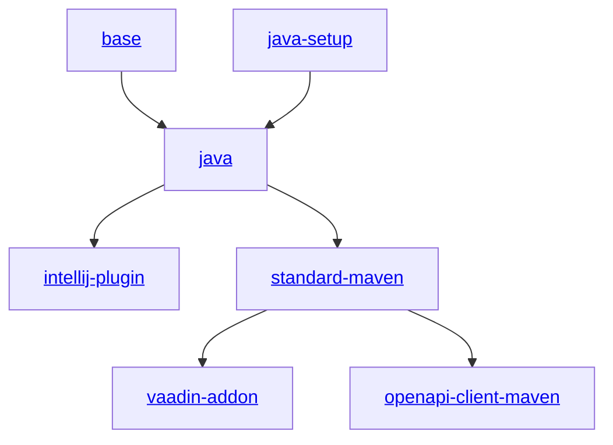

# Template Distributor

Distributes Templates to Template repos
(as it's not possible to run workflows inside Template Repos)

## Overview
Templates are distributed with the following hierarchy:

```mermaid
graph TD;
  base[<a href="https://github.com/xdev-software/base-template">base</a>] --> java
  java-setup[<a href="https://github.com/xdev-software/java-setup-template">java-setup</a>] --> java[<a href="https://github.com/xdev-software/java-template">java</a>]
  java --> intellij-plugin[<a href="https://github.com/xdev-software/intellij-plugin-template">intellij-plugin</a>]
  java --> standard-maven[<a href="https://github.com/xdev-software/standard-maven-template">standard-maven</a>]
  standard-maven --> vaadin-addon[<a href="https://github.com/xdev-software/vaadin-addon-template">vaadin-addon</a>]
  standard-maven --> openapi-client-maven[<a href="https://github.com/xdev-software/openapi-client-maven-template">openapi-client-maven</a>]
```
